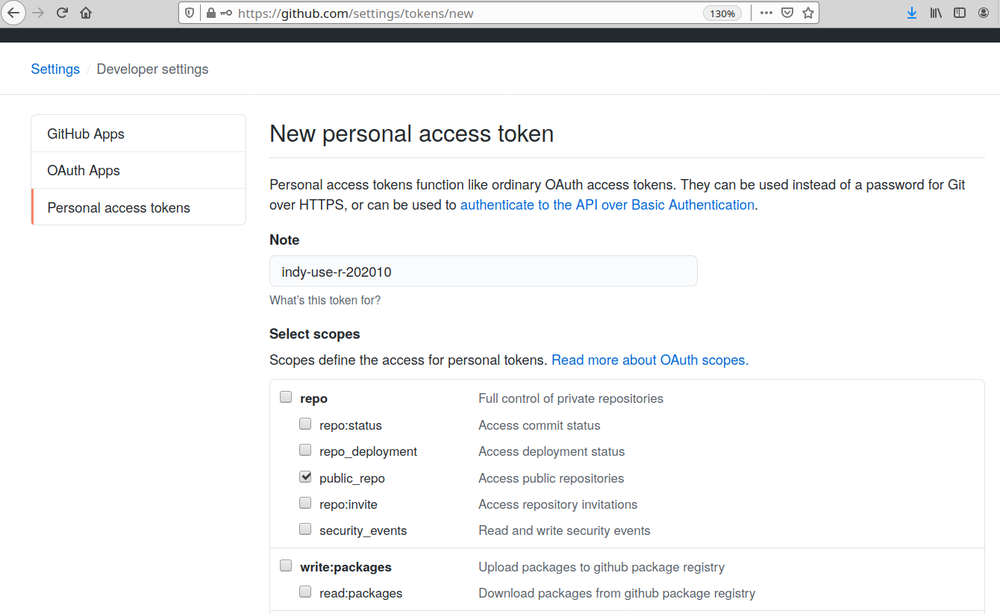

```{r load libraries, echo=FALSE, results=FALSE, warning=FALSE, message=FALSE}
library(dplyr)
library(ggplot2)
library(lubridate)
library(pins)
library(tibble)
```

```{r, echo=FALSE, results=FALSE}
# TODO
# Figure out why i get the following error if i uncomment the `board_register()` below and run all chunks twice:
# Error: The specified pathname is not a file: /home/zx/.cache/pins/local/spirograph_results/_versions

# this is generally not needed,
# but for reproducing the examples here,
# we re-register the "local" board to not track versioning
#board_register("local",  versions = FALSE)
```

# Helpful Links

1. [Javier Luraschi explains the pins package at rstudio::conf 2020](https://rstudio.com/resources/rstudioconf-2020/datasets-in-reproducible-research-with-pins/)
2. [pins package README](https://pins.rstudio.com/index.html)


# The pins package

## Showcased at rstudio::conf 2020

```{r javier-luraschi-rstudio-conf-2020-pins, echo=FALSE, fig.cap="Javier Luraschi at rstudio::conf 2020 explaining the pins package", out.width = '100%'}

```
https://rstudio.com/resources/rstudioconf-2020/datasets-in-reproducible-research-with-pins/

## Pins README

```{r pins-package-readme, echo=FALSE, fig.cap="pins package README", out.width = '100%'}

```
https://pins.rstudio.com/index.html


# Example: Caching results from Spirograph

## Spirograph Refresher

The Original Spirograph Jr. is the easy way for artists to make AMAZING DESIGNS, for ages three and up!

```{r spirograph-box-img, echo=FALSE, fig.cap="Spirographs", out.width = '100%'}

```

We can model spirographs as a sum of exponentials.

```{r modeling-spirographs-img, echo=FALSE, fig.cap="Modeling spirographs", out.width = '100%'}

```

Spirograph Function
```{r spirograph-function}
spiro <- function(n1,n2,n3) {
  t <- seq(0,1,length.out=1000)
  z <- exp(1i*2*pi*n1*t) + exp(1i*2*pi*n2*t) + exp(1i*2*pi*n3*t)
  result <- tibble::tibble(x=Re(z),y=Im(z))
  return (result)
}
```

Generate the x-y points for a spirograph with `n1=7`, `n2=13`, `n3=13`
```{r calculate-spirograph-points-1}
n1 <- 7
n2 <- 13
n3 <- 7

result = spiro(n1, n2, n3)

result
```

Plot the result
```{r plot-first-spirograph}
ggplot2::ggplot(data=result,aes(x=x,y=y)) +
    geom_path() +
    xlab("Real(z)") +
    ylab("Imag(z)")
```

Save the inputs and outputs
```{r }
first_spirograph_data <- tibble::tribble(
  ~date, ~n1, ~n2, ~n3, ~x, ~y,
   lubridate::now(), n1,  n2,  n3, result$x, result$y
)

first_spirograph_data
```

Save the result as a pin to the local cache
```{r save-run-as-pin-local}
pin(
  first_spirograph_data,
  name="spirograph_results"
)
```

Use `pin_get(...)` to retrieve the cached data
```{r retrieve-cached-spirograph-results}
pinned_spirograph_data <- pin_get("spirograph_results")

pinned_spirograph_data
```

Calculate a second spirograph with `n1=13`, `n2=-7`, `n3=-3`
```{r calculate-spirograph-points-2}
n1 <- 13
n2 <- -7
n3 <- -3

result = spiro(n1, n2, n3)

result
```

Plot the new spirograph results
```{r plot-second-spirograph}
ggplot2::ggplot(data=result,aes(x=x,y=y)) +
    geom_path() +
    xlab("Real(z)") +
    ylab("Imag(z)")
```

Save the inputs and outputs of the simulation.
```{r}
second_spirograph_data <- tibble::tribble(
  ~date, ~n1, ~n2, ~n3, ~x, ~y,
   lubridate::now(), n1,  n2,  n3, result$x, result$y
)

second_spirograph_data
```

Combine the second spirograph data with our previously pinned first spirograph data
```{r}
all_spirograph_data <- dplyr::bind_rows(pinned_spirograph_data, second_spirograph_data)

all_spirograph_data
```

Update the spirograph data in the cache by using the `pin()` function
```{r}
pin(all_spirograph_data, "spirograph_results")
```

You can use the `pin_versions()` function to see different versions of your pinned resource. By default, the `local` board doesn't support versioning.
```{r}
pin_versions("spirograph_results", board="local")
```

Let's turn versioning on for the `local` board, then pin the first version of our resource, holding data for only the first spirograph, and the second version of the resource, holding data for the first and second spirographs:
```{r}
board_register("local", versions = TRUE)
pin(first_spirograph_data, "spirograph_results")
pin(all_spirograph_data, "spirograph_results")
pin_versions("spirograph_results", board="local")
```

# Sharing the cached data with others

## Setup the Github Personal Access Token (GITHUB_PAT)

1. Login to https://github.com
2. Go to the Developer Settings page
  a. Settings -> Developer Settings -> Personal access token -> New Token
  b. https://github.com/settings/tokens/new
3. Choose a token name
4. Select the `public_repo` scope
5. Click the generate token button at the bottom of the page


```{r create-github-pat-img, echo=FALSE, fig.cap="Create a Github Personal Access Token", out.width = '100%'}

```


Save the token to your `~/.Renviron` with the name `GITHUB_PAT` either by editing it with your favorite text editor, or by using the `usethis::edit_r_environ()`.

To learn more about how R uses different dot files, see:
https://support.rstudio.com/hc/en-us/articles/360047157094-Managing-R-with-Rprofile-Renviron-Rprofile-site-Renviron-site-rsession-conf-and-repos-conf

```{r add-github-pat-to-renviron, eval=FALSE}
usethis::edit_r_environ()
```

Restart the R session for the changes to take effect.

Check that the GITHUB_PAT environment variable is available
```{r}
nchar(Sys.getenv("GITHUB_PAT")) > 0
```

## Manually create a new repository

This repository will hold the data for your github based board.

```{r create-github-repo-for-boards-img, echo=FALSE, fig.cap="Create a Github Repository to hold board data", out.width = '100%'}

```

## Register your github based board

Use the `board_register_github()` function to register your github based board. In the code block below, we set the name of the board to "indy-use-r-2020-data" instead of "github" so we can better identify this board from other github based boards we may create later.

```{r register-github-based-board}
board_register_github(
  name="indy-use-r-202010-data",
  repo="dskard/indy-use-r-202010-data"
)
```

If the `GITHUB_PAT` environment variable was not set, it can optionally be provided as the `token` parameter to the `board_register_github()` function call above.

## Pin the spirograph data to the github based board

With the Github based board setup, we can now pin data to the board. Use the same `pin()` command we used earlier, but also specify the name of our board `indy-use-r-202010-data`.

```{r pin-spirograph-data-to-github-based-board}
pin(
  all_spirograph_data,
  name="spirograph_results",
  description="results from previous runs of the spirograph simulation",
  board="indy-use-r-202010-data"
)
```

By default, github boards are versioned. We can use the `pin_versions()` function to see the versions we have cached.

```{r check-version-of-pinned-spirograph-results-in-github}
pin_versions("spirograph_results", board="indy-use-r-202010-data")
```


Use the retrieved data to plot a spirograph
```{r}
result <- all_spirograph_data %>%
  dplyr::filter(n1 == 13, n2 == -7, n3 == -3)

result <- result %>%
  select(x,y)  %>%
  tidyr::unnest(c(x, y))

ggplot2::ggplot(data=result,aes(x=x,y=y)) +
    geom_path() +
    xlab("Real(z)") +
    ylab("Imag(z)")
```

## Update our Shiny application to use the pinned data

Our last exercise for today is to incorporate the pinned data into our Shiny application. After the update, the application will first check the data in the cache to see if the simulation has been performed before. If so, we use the previously generated x-y data to generate the plot. If not, we calculate new x-y data, generate the plot, and possibly allow the user to save the new simulation run to the cache. 


```{r spirograph-in-shiny-with-cache-img, echo=FALSE, fig.cap="Spirograph in Shiny, with previously cached results", out.width = '100%'}

```